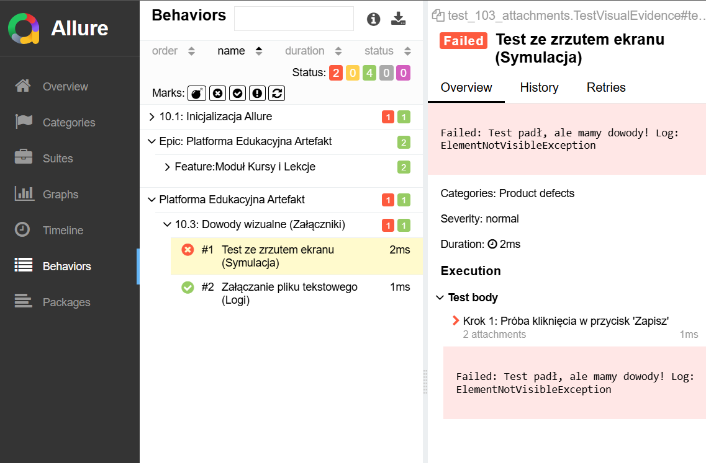

# 📱 Mobile Automation & Cloud-Ready Testing Suite

**Prowadzący:** mgr Mariusz Dworniczak 
**Student:** Tomasz Bednarz 
**Numer Albumu:** 99080

---

## 🏗️ Architektura Projektu (Marketing & Tech Stack)
Ten projekt to kompletny ekosystem testowy oparty na podejsciu **Cloud-Ready / Headless**. Zamiast polegać na ciężkich emulatorach, skupiamy się na narzędziach CLI, analizie statycznej, konteneryzacji (Docker) oraz automatyzacji procesów (Pipeline). 

**Główne technologie:**
* **Język:** Python 3.10+
* **Automatyzacja UI:** Appium 2.x (Mobile Engine)
* **Infrastruktura:** Docker & Docker Compose
* **Raportowanie:** Allure Framework
* **Analiza:** MobSF (Static Analysis) & ADB CLI

---

## 📅 PRZEBIEG LABORATORIUM (Kamienie Milowe)

### 🔹 BLOK 1: Tooling & Environment (Infrastruktura)
Przygotowanie bazy narzędziowej w modelu kontenerowym.
* **Co zrobiono:** Pobranie i konfiguracja obrazów `appium`, `android-sdk` oraz `mobsf`.
* **Wniosek:** Zastosowanie kontenerów Docker umożliwia szybkie i powtarzalne przygotowanie środowiska testowego bez konfliktów zależności. Dzięki temu unikamy problemów związanych z konfiguracją lokalną, a cały stack (Appium, Android SDK, MobSF) działa identycznie na każdym stanowisku, co zwiększa stabilność i przenośność projektu.

### 🔹 BLOK 2: Debugowanie i Analiza Statyczna (MobSF)
Zrozumienie "wnętrza" aplikacji mobilnej przed przystąpieniem do testów.
* **Co zrobiono:** Wykorzystanie MobSF do skanowania plików APK pod kątem podatności i uprawnień.
* **Wniosek:** Analiza statyczna APK pozwala zidentyfikować potencjalne podatności, nadmiarowe uprawnienia oraz niebezpieczne fragmenty kodu jeszcze przed uruchomieniem aplikacji. Dzięki temu tester może szybciej zrozumieć strukturę aplikacji i skupić się na najbardziej ryzykownych obszarach podczas testów dynamicznych.

### 🔹 BLOK 3-4: Fundamenty Skryptowania (Python for QA)
Budowa logiki testowej w języku Python.
* **Co zrobiono:** Nauka podstawowych struktur danych w Pythonie, takich jak listy, słowniki i krotki, oraz definiowania funkcji i obsługi warunków (if/else). Wykorzystanie pętli (for, while) do iteracji oraz modularnego podejścia do kodu poprzez tworzenie reużywalnych funkcji wspierających logikę testów.

### 🔹 BLOK 5-7: Hybrydowe Testowanie API (Requests & Pytest)
Weryfikacja warstwy backendowej aplikacji mobilnej.
* **Co zrobiono:** Testowanie endpointów REST (JSONPlaceholder), obsługa kodów HTTP i asercja danych JSON.
* **Wniosek:** Testowanie API pozwala wyłapać błędy zanim uruchomimy ciężkie testy UI.

### 🔹 BLOK 8: Appium UI Automation (Deep Dive)
Automatyzacja interakcji z interfejsem użytkownika.
* **Co zrobiono:** Wykorzystanie selektorów takich jak resource-id, accessibility id oraz XPath do lokalizowania elementów interfejsu. Symulowanie akcji użytkownika, takich jak kliknięcia, wprowadzanie tekstu, scrollowanie oraz nawigacja między ekranami. Implementacja prostych scenariuszy testowych odwzorowujących realne użycie aplikacji.

### 🔹 BLOK 9: Konteneryzacja Serwera (Docker Compose)
Izolacja silnika Appium od systemu operacyjnego.
* **Co zrobiono:** Stworzenie pliku `docker-compose.yml` zarządzającego serwerem Appium i sterownikami.

### 🔹 BLOK 10: MASTER PIPELINE (Capstone Project) 🏆
Finałowa automatyzacja całego procesu testowego.
* **Co zrobiono:** Stworzenie skryptu `pipeline.py`, który w jednym cyklu:
1. Rezerwuje zasoby i stawia infrastrukturę Docker.
2. Wykonuje testy hybrydowe (API + UI).
3. Generuje profesjonalny raport Allure z metadanymi.
4. Czyści środowisko po zakończonej pracy.

---

## 📊 Raportowanie Wyników (Allure)
Projekt wykorzystuje zaawansowane raportowanie Allure, które pozwala na:
* Śledzenie kroków testowych (`@allure.step`).
* Analizę błędów wraz z załącznikami (zrzuty ekranu, logi JSON).
* Dokumentowanie środowiska wykonawczego w sekcji **Environment**.


---

## 🚀 Jak uruchomić cały proces?
```bash
# Wejdź do folderu finałowego
cd Artefakt10

# Uruchom wszystko jednym poleceniem
python3 pipeline.py

# Po zakończeniu zobacz raport
allure serve allure-results